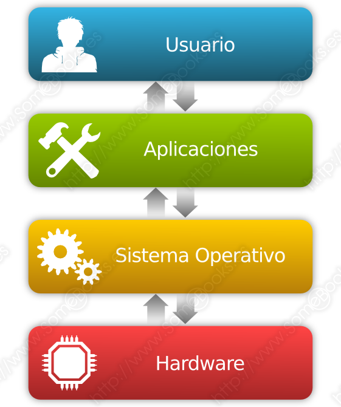
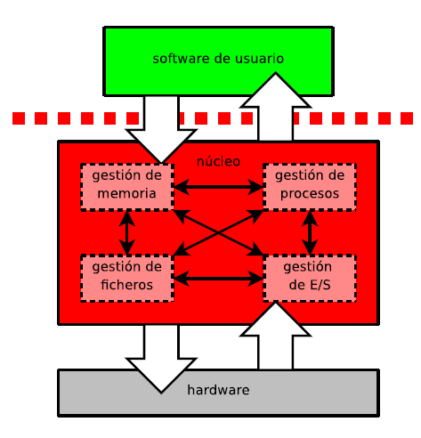
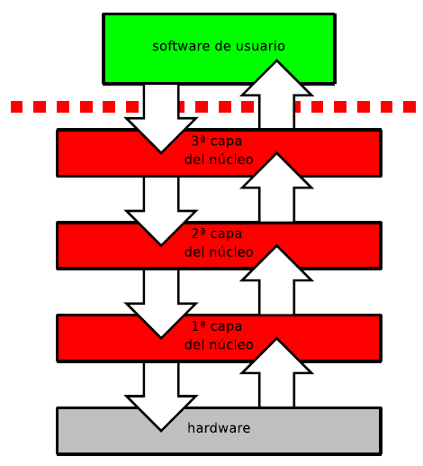

# Sistemas operativos

Actualmente, un ordenador es una máquina muy compleja que puede constar de uno o más procesadores, discos, escáneres, tarjetas de comunicaciones, impresoras, módems, etc. Los dispositivos que contiene el ordenador son de tipo diverso (ópticos, magnéticos, etc.), tienen un funcionamiento muy variado, la tecnología de funcionamiento y el tipo de apoyo utilizado tienen características diferentes. Así, si un usuario quiere usar este sistema de manera eficiente, necesita conocer las características, controlar el funcionamiento, etc. Por lo tanto, hay que pensar que hay de haber una solución que permita a los usuarios utilizar esta máquina de una manera más sencilla, fácil y eficiente.

Podemos imaginar un sistema operativo como los programas que hacen utilizable el hardware. El hardware proporciona la “capacidad para operar” mientras que los sistemas operativos ponen esta capacidad de operación al alcance de los usuarios y administran de manera segura el hardware para conseguir un buen rendimiento.

Los sistemas operativos son los administradores de los recursos del sistema (procesadores, almacenamiento, dispositivos de E/S, datos, etc.).

En la imagen se muestran los niveles de software y hardware de un ordenador. También podéis observar como el sistema operativo es la única capa que trabaja directamente con el hardware. Por encima del sistema operativo se encuentra un nivel formado por los traductores, editores de texto y los intérpretes de órdenes. Esto nos permite crear varios niveles de abstracción que permiten trabajar con el ordenador de una forma mucho mas sencilla.

La unión de los programas de las dos capas intermedias de la imagen conforman el software de sistemas de un ordenador. Finalmente, hay el nivel constituido por los programas de aplicación; estos programas no dan un servicio en otros programas, su finalidad es resolver problemas concretos. Son los programas que ejecuta un usuario no informático. Pertenecen a esta capa los procesadores de texto, las hojas de cálculo, las agendas electrónicas, los juegos, etc.

El hardware facilita los recursos básicos de computación, mientras que los programas de aplicación definen como se tienen que utilizar estos recursos para resolver los problemas de los usuarios. Puede haber molidos usuarios diferentes tratante de resolver problemas diferentes. Por consiguiente, es habitual la existencia de diferentes programas de aplicación. El sistema operativo controla y coordina el uso del hardware por parte de los diferentes programas de aplicación de los varios usuarios.

Los sistemas operativos construyen recursos de alto nivel que denominamos virtuales, a base de esconder los que realmente hay en el nivel bajo y que denominamos físicos. En consecuencia, desde el punto de vista del usuario o del proceso, la máquina física es convertida por el sistema operativo en una máquina virtual, también conocida como máquina extendida y que, a diferencia de la física, ofrece al usuario muchas más funciones y más comodidad en la hora de utilizarla.

Además, el sistema operativo proporciona servicios de los cuales no dispone el hardware, como por ejemplo la posibilidad de utilizar el ordenador por varios usuarios, la multiprogramación, etc.

## Tipos de sistemas operativos

- **Monolíticos:** Es la estructura de los primeros sistemas operativos, consistía en un solo programa desarrollado con rutinas entrelazadas que podían llamarse entre sí. Por lo general, eran sistemas operativos hechos a medida, pero difíciles de mantener.

- **Jerárquicos:** Conforme las necesidades de los usuarios aumentaron, los sistemas operativos fueron creciendo en complejidad y funciones. Esto llevó a que se hiciera necesaria una mayor organización del software del sistema operativo, dividiéndose en partes más pequeñas, diferenciadas por funciones y con una interfaz clara para interoperar con los demás elementos. Un ejemplo de este tipo de sistemas operativos fue MULTICS.

- **Capas**: El sistema operativo se organiza por capas, las capas superiores utilizan las inferiores. De esta forma, cada capa solo se fija en los detalles suyos. Un sistema de capas es THE

- **Microkernel**: los ordenadores son muy rápidos y se realizan muchos cálculos. Hay muchos fallos  (pocos para la cantidad de operaciones que realiza un PC). Para incrementar la tolerancia a fallos, se dividen en pequeños núcleos: operaciones de entrada/salida, gestión de memoria, del sistema de archivos, etc. Un sistema microkernel es MINIX

- **Cliente-servidor**: basándose en la estructura microkernel, se crea esta estructura, donde el cliente solicita una petición de un servicio en la red, y el servidor responde.

- **Máquina virtual**: integran distintos sistemas operativos en una sola máquina, dando la sensación de máquinas diferentes. En cada una de ellas, se puede ejecutar un sistema operativo distinto. Las máquinas virtuales las vamos a utilizar todo el curso, las más conocidas son VMware y VirtualBox. 

## Componentes de un sistema operativo

El núcleo es el módulo más bajo del sistema operativo, descansa directamente sobre el hardware del ordenador. Entre las tareas que hace hay la manipulación de las interrupciones, la asignación de trabajos al procesador y el de proporcionar un cauce de comunicación entre los diferentes programas.

En general, el núcleo se encarga de controlar el resto de los módulos y sincronizar la ejecución. El núcleo contiene:

- Un **planificador**, el cual se encarga de asignar el tiempo de procesador en los programas, de acuerdo con cierta política de planificación que varía de un sistema operativo a otro. Normalmente se utiliza una jerarquía de prioridades que determinan como se asignará el tiempo de CPU en cada programa. Una política de planificación muy común en los sistemas operativos multiprograma y multiacceso son las técnicas de time-slicing (fracción de tiempo). Se asigna en cada programa cierto intervalo de tiempo del procesador. Si el programa no ha acabado durante este tiempo, vuelve a la cola de programas.

- Submódulo para el control de **interrupciones** (*FLHI, first level interruption handler*). Este submódulo está vinculado al planificador, puesto que se utilizan interrupciones para modificar la seqüencialització del procesos. Es el encargado de dar respuesta a los cuatro tipos de interrupciones:
    - Interrupciones de programa
    - Interrupciones de reloj del sistema
    - Interrupciones de entrada/salida
    - Interrupciones por fallo del hardware
- **Comunicador de procesos** (semáforos, mecanismos de *waiting/signal*): encargado de evitar los bloqueos entre procesos, y ayuda a la volver a poner en marcha los procesos, tarea muy importante en el control de concurrencia en sistemas operativos multiprograma y de procesos distribuidos.

El núcleo del sistema operativo generalmente realiza las funciones siguientes:

- Manipulación de interrupciones.
- Creación y destrucción de procesos.
- Cambio de estados de procesos.
- Despacho (dispatcher).
- Suspensión y reanudación de procesos.
- Sincronización de procesos.
- Comunicación entre procesos.
- Manipulación de bloques de control de proceso.
- Apoyo de actividades de E/S.
- Apoyo de la asignación y desassignació de almacenamiento.
- Apoyo del sistema de archivos.
- Apoyo de mecanismos de llamamiento/retorno al procedimiento.
- Apoyo de ciertas funciones estadísticas del sistema.

El sistema operativo dispone de tres mecanismos de acceso al núcleo, pero el único de estos acontecimientos que puede usar el usuario para hacer una petición al sistema operativo es el salto no programado.

Un salto no programado se produce cuando el procesador ejecuta la instrucción de lenguaje máquina con saltos no programados. En la ejecución de esta orden están implicadas tres acciones: el cambio de modo de ejecución de modo usuario a modo núcleo, la ejecución de una rutina de servicio y el cambio de modo de ejecución de modo núcleo a modo usuario.

## Núcleo de Sistemas Operativos UNIX

El núcleo del sistema operativo Unix (llamado kernel) es un programa escrito casi todo en lenguaje C, excepto de una parte correspondiente a la manipulación de interrupciones, expresada en el lenguaje ensamblador del procesador en que opera.

El kernel se encarga de asignar recursos para cualquier proceso que necesite hacer uso del hardware del ordenador. Es el elemento central del sistema Unix.

Lo kernel tiene el control sobre el ordenador por lo que si un proceso necesita un recurso, este deberá indicarlo al kernel por medio de un módulo especial llamado llamamiento al sistema.

Lo kernel consta de dos partes principales:

 - La sección de control de procesos encargada de asignar recursos a programas y procesos y apoyar a las demandas de servicios del equipo.
- La sección de control de dispositivos que supervisa la transferencia de datos entre la memoria principal y los periféricos.

En términos generales, cada vez que un usuario utiliza cualquier tecla de un ordenador, o que se tenga que leer o escribir información desde las unidades magnéticas, se interrumpe el procesador y el núcleo se encarga de efectuar la operación de transferencia.

## Administrador de memoria

Este módulo se encarga de asignar ciertas porciones de la memoria principal (RAM) a los diferentes programas o partes de los programas que la necesitan, mientras que el resto de datos y los programas se mantienen en los dispositivos de almacenamiento masivo, como un HDD o un SDD.

Es decir que el administrador de memoria es el que:

- Ubica, reemplaza, carga y descarga los procesos en la memoria principal.
- Protege la memoria de los accesos no queridos (accidentales o intencionados).
- Permite compartir zonas de memoria (indispensables para la cooperación de procesos).

Un administrador de memoria necesita cinco funciones básicas:

- **Reubicación**: permite el volver a calcular direcciones de memoria.
- **Protección**: evita el acceso de posiciones de memoria sin permiso.
- **Compartición**: permite a procesos diferentes acceder a un mismo lugar de memoria.
- **Organización lógica**: permite que los programas se escriban como módulos compatibles y ejecutables por separado.
- **Organización física**: permite el intercambio de memoria principal y memoria secundaria.

>Para llevar a cabo estas funciones nos encontramos con seis técnicas utilizadas por el administrador de memoria:
>
>- Partición fija
>- Partición dinámica
>- Partición simple
>- Segmentación simple
>- Memoria virtual paginada
>- Memoria virtual segmentada
>
>La forma más común de administración de la memoria implica crear una **memoria virtual**; con este sistema, la memoria del ordenador aparece, para cualquier usuario del sistema, más grande del que es.

## Sistema de entrada/salida (E/S)

Este componente presenta al usuario los datos como una cuestión independiente del dispositivo; es decir, para los usuarios, todos los dispositivos tienen las mismas características y son tratados del mismo modo, en qué es el sistema operativo el responsable de atender las particularidades de cada uno.

Hay cinco funciones que el sistema de entrada/salida(E/S) tiene que cumplir:

- Garantizar el acceso a los dispositivos teniendo en cuenta que un proceso solo puede acceder a las partes a que tenga derecho.
- Ofrecer un servicio a los procesos, sin necesidad de conocer el dispositivo de E/S.
- Tratar las interrupciones, señales recibidas por el procesador de un ordenador, indicando que tiene que interrumpir el curso de la ejecución actual y pasar a ejecutar un código específico para tratar esta situación, generada por los dispositivos.
- Planificar los accesos de los dispositivos de forma que se pueda realizar un uso equitativo.
- Mantener la eficiencia del sistema procurando que no aparezcan cuellos de botella.

En el momento en que el dispositivo, tanto de entrada como de salida, hace un acceso al sistema, el mismo gestor hace una diferenciación clara de los dispositivos y los divide en los siguientes:

- Dispositivos de bloque. Son los dispositivos que tienen almacenada la información mediante bloques con longitud fija, es decir, se podrá leer, escribir y hacer operaciones de búsqueda. Ejemplo: el disco duro, CD, etc.
- Dispositivos de carácter. Son los dispositivos que envían y reciben información por medio de caracteres, sin tener una longitud fija. Estos dispositivos se podrán leer pero no se podrán hacer operaciones de búsqueda.

Por otro lado, y dependiendo de las características del dispositivo E/S, hay que distinguir tres tipos de E/S en función de la sincronización del controlador:

- **E/S programada**. La sincronización es lleva a cabo haciendo un bucle de espera activa hasta obtener el estado del controlador activo.
- **E/S por interrupciones**. El controlador activa una interrupción, señal recibida por el procesador de un ordenador, indicando que se tiene que interrumpir el curso de ejecución actual y pasar a ejecutar un código específico para tratar esta situación, que permite la comunicación del sistema operativo y deja que el sistema operativo haga otras tareas. Es la base que permite implementar un sistema operativo multiprograma.
- **E/S por DMA.** Los dispositivos de bloques que necesitan una transferencia de datos muy elevada tienen que utilizar el acceso directo a memoria para las operaciones de E/S.

Las técnicas más utilizadas por los sistemas operativos para gestionar las entradas/salidas son dos:

- **Gestión de colas o *spooling*** (simultaneous peripheral operation en línea). Los datos de salida se almacenan de manera temporal en una cola situada en un dispositivo de almacenamiento masivo (lo spool), hasta que el dispositivo periférico correspondiendo se encuentra libre; de este modo se evita que un programa quede retenido porque el periférico no está disponible. El sistema operativo dispone de llamamientos para añadir y eliminar archivos de la cola del gestor de colas (spooler).
- **Buffering.** Espacios de memoria principal que se reservan para el almacenamiento intermedio de los datos que vienen o van a los dispositivos de E/S; así se consiguen compensar las diferentes velocidades que presentan los dispositivos externos y los dispositivos internos, y se incrementa la eficiencia del sistema sobre todo en los sistemas operativos multiprogramación.

## Administrador de archivos

Esta parte del sistema operativo se encarga de mantener la estructura de los datos y los programas del sistema correspondientes a los diferentes usuarios y de asegurar el uso efectivo de los medios de almacenamiento masivo.

El administrador de archivos también supervisa la creación, actualización y eliminación de los archivos, manteniendo un directorio con todos los archivos que hay en el sistema en cada momento, y coopera con el módulo de administración de memoria durante las transferencias de datos desde y hacia la memoria principal y de los medios de almacenamiento masivo para mantener la estructura de la organización.

Los archivos almacenados en los dispositivos de almacenamiento masivo tienen diferentes propósitos. Algunos contienen información que puede ser compartida. Otros son de carácter privado e incluso secreto. Por lo tanto, cada archivo está dotado de un conjunto de privilegios de acceso, que indican la extensión con la cual se puede compartir la información contenida en el archivo. El sistema operativo comprueba que estos privilegios no sean violados (administración de seguridad).

Hay unas condiciones básicas que todo gestor de archivos tiene que conceder a todos los usuarios, y son:

- Poder crear, leer, borrar e intercambiar ficheros.
- Tener el control de los fichero otros usuarios.
- Controlar qué tipo de acceso se otorga al resto de usuarios.
- Poder ordenar los ficheros mediante directorios.
- Poder mover información entre ficheros.
- Permitir crear y restaurar copias de seguridad.
- Poder crear accesos directos.

Hay diferentes sistemas de archivo, es decir, diferentes maneras de organizar la información que se almacena en las memorias de los ordenadores como, por ejemplo: FAT, FAT32, EXT3, NTFS, XFS, etc.

## Sistema de protección

Como los sistemas operativos son cada vez es más complejos, el número de errores relacionados con la seguridad cada vez es mayor.

Desgraciadamente la complejidad está relacionada con la dificultad de mantener en orden todos los objetivos marcados por el mismo sistema operativo, así pues podemos afirmar que cuanto más cosses intente hacer un sistema operativo más vulnerable podrá llegar a ser, siempre que el sistema de protección no sea el adecuado.

Aquí se gestionan los mecanismos que controlan el acceso en los programas o a los usuarios para poder llegar a los recursos del sistema.

Hay desarrollados diferentes modelos genéricos de protección de recursos para los sistemas operativos, para controlar el acceso de los usuarios a los recursos que pueden ser protegidos o para controlar el mismo sistema operativo, que a veces puede tener un acceso no apropiado. A continuación veremos algunos de los modelos de protección más importantes:

- Modelo de la matriz de acceso: se trata de definir una matriz en función del conjunto de permisos de acceso (lectura, escritura, etc.) que especifica los diferentes permisos que tiene el sujeto para cada objeto en función de las operaciones que puede hacer. Matriz[sujeto,objeto].
- Modelo de seguridad con acreditación y con información clasificada:
    - Cabe usuario no puede leer la información clasificada por encima de su nivel de acreditación.
    - Ningún usuario puede rebajar la clasificación de la información.

## Interfaces de usuario de los sistemas operativos

Una interfaz de usuario es el conjunto de elementos con que los usuarios se comunican o interaccionan con los ordenadores u otras máquinas.

Los sistemas operativos ofrecen dos tipos diferentes de interfaces de usuario:

- Interfaces de usuario alfanuméricas o de línea de órdenes
- Interfaces gráficas de usuario

Las interfaces de usuario de línea de órdenes (o CLI, del inglés command line interface) ofrecen un entorno textual en que el usuario puede introducir instrucciones o órdenes que el entorno interpretará y el sistema operativo ejecutará.

Una interfaz gráfica de usuario (o GUI, del inglés Graphic User Interface) es una interfaz de usuario que utiliza elementos gráficos y el lenguaje visual para interactuar de manera intuitiva con el sistema.

Las interfaces gráficas de usuario que ofrecen los sistemas operativos actuales requieren, básicamente, la interacción del usuario por medio del ratón, a pesar de que también suelen ofrecer apoyo para la interacción por medio del teclado.

Los elementos gráficos que suelen incluir las interfaces gráficas de usuario son los siguientes:

- Sistemas de ventanas, que permiten organizar cada tarea del usuario en una ventana diferente.
- Iconos o imágenes pequeñas que representan objetos del sistema que puede utilizar el usuario para realizar sus tareas.
- Botones y barras de herramientas integradas por conjuntos de botones con funcionalidades parecidas.
- Sistemas de menús desplegables, agrupados según funcionalidades.
- Barras de desplazamiento verticales y horizontales para visualizar varias zonas de la pantalla.
- Pestañas, que organizan las diversas partes de una tarea sub-pantallas.

Actualmente tanto los sistemas operativos como las interfaces de las aplicaciones ofrecen interfaces gráficas de usuario muy evolucionadas, basadas en criterios de usabilidad, muy intuitivas y teniendo en consideración las características psicológicas de las personas.

A pesar de que hay otros tipos de interfaces de usuario (como por ejemplo interfaces basadas en el reconocimiento de la voz, táctiles o basadas en menús), los sistemas operativos ofrecen de manera generalizada los dos sistemas básicos: interfaz gráfica de usuario e interfaz de línea de órdenes. Pero, a veces, pueden ofrecer de manera adicional otros tipos de interfaces.